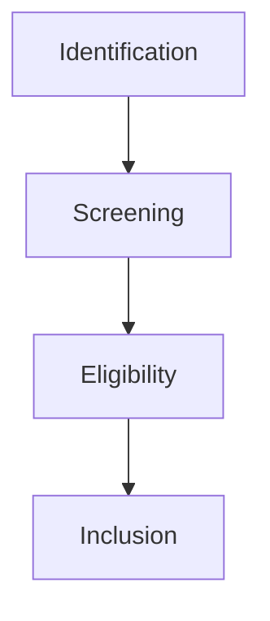

# PRISMA — Revue systématique (gabarit + mermaid)

- **Identification** : DOIs Zenodo, normes, littérature.
- **Screening** : licence, pertinence, qualité.
- **Eligibility** : texte intégral, biblio, traçabilité.
- **Inclusion** : corpus final versionné (v2).
